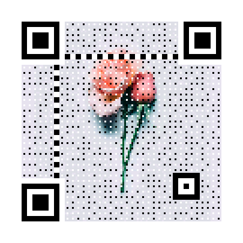

# \#情人节专题#一个记录两个人走过岁月的点点滴滴的idea

### 前言
碰巧我们在一起两周年，花了两天码了一个走心的礼物，于是就有了这个小项目的来源
首先看下实现效果图---一个音乐播放，带图片切换的时间记录器


> **项目地址**：https://github.com/jackluson/to-lover-demo

> 如果觉得不错的话，您可以点右上角 "Star" 支持一下 谢谢！ ^_^

### 技术实现
  - 雪花飘落效果实现

    1.把五张图片充当雪花，然后three.js3D库 + 定时 营造出雪花飘落的效果，大致代码如下：

    ```js
    function init() {
        camera = new THREE.PerspectiveCamera(75, containerWidth / containerHeight, 1, 10000);
        camera.position.z = 1000;
        scene = new THREE.Scene();
        scene.add(camera);
        renderer = new THREE.CanvasRenderer();
        renderer.setSize(containerWidth, containerHeight);
        for (var i = 0; i < snowNum; i++) {
          var material = new THREE.ParticleBasicMaterial({
            map: new THREE.Texture(particleImages[i % 5])
          });
          particle = new Particle3D(material);
          particle.position.x = Math.random() * 2000 - 1000;
          particle.position.y = Math.random() * 2000 - 1000;
          particle.position.z = Math.random() * 2000 - 1000;
          particle.scale.x = particle.scale.y = 1;
          scene.add(particle);
          particles.push(particle)
        }
        container.appendChild(renderer.domElement);
        document.addEventListener("mousemove", onDocumentMouseMove, false);
        document.addEventListener("touchstart", onDocumentTouchStart, false);
        document.addEventListener("touchmove", onDocumentTouchMove, false);
        setInterval(loop, 1000 / 50)
      }
    ```

  - 倒计时
    1.这个不用多说，给一个起初时间和当前时间对比，然后操作对应的dom元素,然后控制title

    ```js
    countTime('2017/02/12 00:00', 'day', 'hour', 'minute', 'second');
    var days = parseInt($('#day').text());
    var years = new Date().getFullYear();
    var month = new Date().getMonth() + 1;
    var dateDay = new Date().getDate();
    ```

  - 图片，描述文字的切换
    1.为了避免图片过多同时加载缓慢问题--这里js设置一个图片列表和对应两个图片描述两个变量，同时为了保证图片加载出来才切换图片描述文字，用到了img的load事件函数

    ```js
    curImgDom.src = imgList[imgIndex];
      // curImgDom.setAttribute('src', imgList[imgIndex]);
      if (isInitImage) {
          $('.img-intro').text(imgDescList[imgIndex]);
          return;
      }else {
          // curImgDom.src = imgList[imgIndex];
          if (curImgDom.complete) {
              $('.img-intro').text(imgDescList[imgIndex]);
              return false;
          }
          curImgDom.onload = function () {
              $('.img-intro').text(imgDescList[imgIndex]);
          };
      }
    ```

  - 音频播放
    1.这里音频设置自动，循环播放，点击图标暂停，播放切换。这里监听了audio的play，canplaythrough（保证音频加载完毕）事件，这里值得注意一点是，audio的play（）方法执行后返回来的promise对象，用来判断是否成功执行（播放），可以根据这个promise控制音乐🎵图标的旋转or停止状态，大致代码如下：

    ```javascript
    audioDom.addEventListener('canplaythrough', function () {
          try {
              // chrome浏览器没有也页面交互（点击，滚动）之前会报错误---Uncaught（in promise）DOMException：play（）
              //处理方法设置浏览器autoplay-policy---https://blog.csdn.net/super_XYQ/article/details/83026792
              var promise = audioDom.play();
              if (promise !== undefined) {
                  promise.then(function () {
                      musicCloseDom.classList.add('rotate');
                  }).catch(function () {
                      musicCloseDom.classList.remove('rotate');
                  });
              }
          } catch (error) {
              console.log('error', error);
          }
      }, false);
    ```

  - 设置Open graph(从浏览器分享到社交网络配置)
    .jpg)

    代码如下

    ```html
    <!--从chrome分享到微信效果如上-->
    <meta property="og:type" content="website">
    <meta property="og:url" content="https://jackluson.github.io/to-lover-demo/">
    <meta property="og:description" content="一个记录“我们在一起走过点点滴滴”的idea">
    <meta property="og:title" content="宝贝,感谢你一直的陪伴！">
    <meta property="og:image" content="https://jackluson.github.io/to-lover-demo/pic-icon.png">
    <meta property="og:image:width" content="140">
    <meta property="og:image:height" content="109">
    ```

    

### 其他

1. 这里用到了python脚本生成艺术二维码

   

   ```python
   version, level, qr_name = myqr.run(
   	'https://jackluson.github.io/to-lover-demo/',
   	# 'https://jackluson.github.io/to-lover/',
       version=1,
       level='H',
       picture='pic-icon.png',
       colorized=True,
       contrast=1.0,
       brightness=1.0,
       save_name='ip_jackLu.png',
       save_dir=os.getcwd()
   )
   ```

2. 还有利用python压缩图片，与剪切音频，避免文件过大

   ```python
   from glob import glob
   from PIL import Image
   import pyperclip
   source_dir = 'origin_images'
   target_dir = 'images'
   threshold = 1.5*1024*1024
   if not os.path.exists(target_dir):
       os.makedirs(target_dir)
   filenames = glob('{}/*.[jp]*'.format(source_dir))
   # print(','.join(filenames))
   strFileNames = ''
   for i,filename  in enumerate(filenames):
     # 拼接文件名字符串
     strFileNames = strFileNames +  '"' + filename +'",'
     filesize = os.path.getsize(filename)
     output_filename = filename.replace(source_dir, target_dir)
     # output_filename = time.strftime("%Y-%m-%d", time.localtime()) + '000' + str(i) + '.png';
   
     print('output_filename:',output_filename)
     if filesize >= threshold:
       print(filename)
       with Image.open(filename) as im:
         width, height = im.size
         new_width = width // 2
         new_height = int(new_width * height * 1.0 / width)
         print('adjusted size:', new_width, new_height)
         resized_im = im.resize((new_width, new_height))
         resized_im.save(output_filename)
     else:
       with Image.open(filename) as im:
         im.save(output_filename)
   
   # 字符串复制到剪切板
   strFileNames = strFileNames.replace(source_dir + '\\', './' + target_dir + '/')
   print(strFileNames[0:-1]);
   pyperclip.copy(strFileNames[0:-1]);
   spam = pyperclip.paste()
   # 剪切音频
   from pydub import AudioSegment
   file_name = "./media/zui-mei-qing-lv.mp3"
   sound = AudioSegment.from_mp3(file_name)
   start_time = "0:08"
   stop_time = "1:37"
   print ("time:",start_time,"~",stop_time)
   start_time = (int(start_time.split(':')[0])*60+int(start_time.split(':')[1]))*1000
   stop_time = (int(stop_time.split(':')[0])*60+int(stop_time.split(':')[1]))*1000
   print("ms:",start_time,"~",stop_time)
   word = sound[start_time:stop_time]
   # save_name = "xiaye-and-anlian.mp3-"+file_name[6:]
   save_name = "./media/zui-mei-qing-lv-cut.mp3"
   print (save_name)
   word.export(save_name, format="mp3",tags={'artist': 'AppLeU0', 'album': save_name[:-4]})
   ```

   
